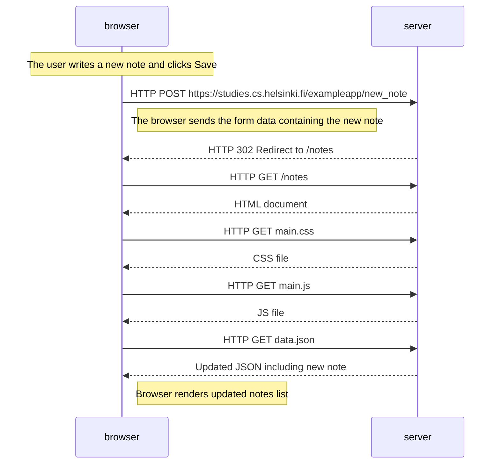

# Part 1: Creating a New Note (Normal Version)

```mermaid
sequenceDiagram
    participant browser
    participant server

    Note over browser: The user writes a new note and clicks Save

    browser->>server: HTTP POST https://studies.cs.helsinki.fi/exampleapp/new_note
    Note right of browser: The browser sends the form data containing the new note
    server-->>browser: HTTP 302 Redirect to /notes

    browser->>server: HTTP GET /notes
    server-->>browser: HTML document

    browser->>server: HTTP GET main.css
    server-->>browser: CSS file

    browser->>server: HTTP GET main.js
    server-->>browser: JS file

    browser->>server: HTTP GET data.json
    server-->>browser: Updated JSON including new note

    Note right of browser: Browser renders updated notes list
```