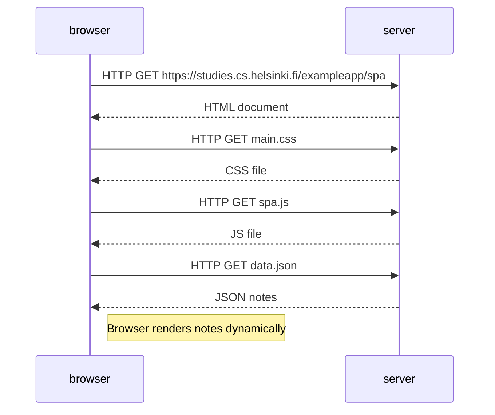

# Part 2: Loading the Single Page App (SPA)

```mermaid
sequenceDiagram
    participant browser
    participant server

    browser->>server: HTTP GET https://studies.cs.helsinki.fi/exampleapp/spa
    server-->>browser: HTML document

    browser->>server: HTTP GET main.css
    server-->>browser: CSS file

    browser->>server: HTTP GET spa.js
    server-->>browser: JS file

    browser->>server: HTTP GET data.json
    server-->>browser: JSON notes

    Note right of browser: Browser renders notes dynamically
```