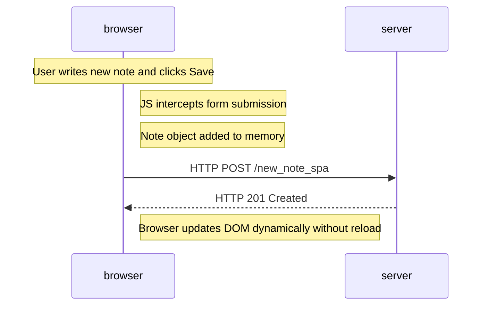

# Part 3: Creating a New Note in the SPA

```mermaid
sequenceDiagram
    participant browser
    participant server

    Note over browser: User writes new note and clicks Save

    Note right of browser: JS intercepts form submission
    Note right of browser: Note object added to memory

    browser->>server: HTTP POST /new_note_spa
    server-->>browser: HTTP 201 Created

    Note right of browser: Browser updates DOM dynamically without reload
```